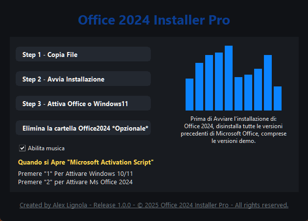
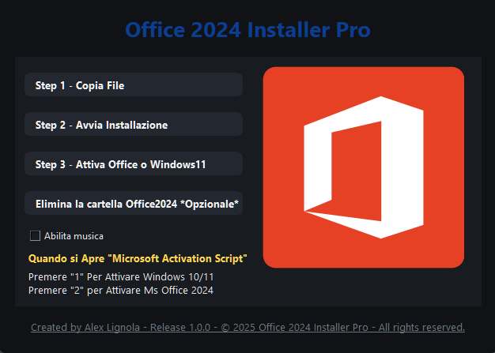

# Office-2024-Installer-Pro
App Standalone per l'installazione e l'attivazione di Microsoft Office 2024 x64
### Office 2024 Installer Pro (.EXE Standalone)

Office 2024 Installer Pro è distribuito anche come **eseguibile standalone per Windows 10/11**, pensato per utenti finali che non vogliono installare Python o librerie aggiuntive.
___________________________________________________________________________________________________________________________________________________

___________________________________________________________________________________________________________________________________________________

___________________________________________________________________________________________________________________________________________________


Questa versione è stata generata a partire dallo script Python Office-2024-Installer-Pro.py`, ma è stata **impacchettata in un unico file `.exe`** tramite tool come PyInstaller / simili.

## Descrizione

Office 2024 Installer Pro è un piccolo installer guidato che semplifica:

- Copia dei file necessari di Office in `C:\Office2024`
- Avvio dell’installazione di Microsoft Office 2024 tramite `setup.exe` e `Configurazione.xml`
- Apertura dello script di attivazione (Microsoft Activation Script) per Office e Windows 10/11
- Pulizia finale della cartella `C:\Office2024`

Il tutto all’interno di una **GUI moderna** con:

- Tema scuro
- Card centrale con i pulsanti dei 3 step
- Immagine `Office.png` sul lato destro
- Musica di sottofondo con analizzatore di spettro grafico
- Footer con link al canale YouTube _Angolo Informatico_


## Requisiti (versione .EXE)

- **Sistema operativo**: Windows 10 o Windows 11 (64 bit consigliato)
- **Permessi**: account con diritti amministrativi (necessari per l’installazione di Office e lo script di attivazione)
- **File presenti accanto all’eseguibile** (se non sono incorporati nel packaging):
  - `Configurazione.xml` – file di configurazione per `setup.exe`
  - `setup.exe` – installer di Microsoft Office 2024
  - `Office.png` – immagine mostrata nella card
  - `electronica.mp3` – file audio usato per la musica di sottofondo

> A seconda di come è stato configurato il packaging, alcuni file potrebbero essere già inclusi nelle risorse interne dell’eseguibile.  
> In alternativa, possono essere distribuiti nella **stessa cartella** del `.exe`.


## Come usare la versione .EXE

1. Scarica il file  [Office2024.Installer.Pro.rar](https://github.com/AngoloInformatico/Office-2024-Installer-Pro/releases/download/v.1.0.0/Office2024.Installer.Pro.rar)
2. Estrai il contenuto in una cartella a tua scelta.
3. Per Funzionare , i seguenti tre file devono trovarsi nella stessa cartella:
   - `Configurazione.xml`
   - `setup.exe`
   -  `Office 2024 Installer Pro.exe`
4. Esegui il file ``Office 2024 Installer Pro.exe` con doppio clic.
5. Verrà aperta la finestra **Office 2024 Installer Pro**.


### Flusso operativo

1. **Step 1 – Copia File**
   - Clicca su **“Step 1 - Copia File”**.
   - I file `Configurazione.xml` e `setup.exe` vengono copiati nella cartella `C:\Office2024` (creata se non esiste).
   - Se la copia va a buon fine, un messaggio confermerà l’operazione.

2. **Step 2 – Avvia Installazione**
   - Clicca su **“Step 2 - Avvia Installazione”**.
   - Si apre una finestra di comando elevata (cmd/PowerShell) che esegue:
     ```cmd
     setup.exe /configure Configurazione.xml
     ```
   - Segui le istruzioni di installazione di Office.

3. **Step 3 – Attiva Office o Windows 10/11**
   - Clicca su **“Step 3 - Attiva Office o Windows11”**.
   - Viene aperto Microsoft Activation Script tramite PowerShell con diritti appropriati.
   - All’interno dello script:
     - Premi `1` per attivare Windows 10/11
     - Premi `2` per attivare Office 2024

4. **Elimina cartella Office2024**
   - Se non devi piu utilizzare la cartella C:/Office2024 prima dell'installazione, puoi cliccare su **“Elimina la cartella Office2024”**.
   - Verrà chiesta conferma e, in caso affermativo, la cartella `C:\Office2024` verrà rimossa.


## Musica e analizzatore di spettro

- All’avvio, se la musica è abilitata, l’app riproduce in loop il file `electronica.mp3` e mostra **a destra** un analizzatore di spettro animato.
- Un flag **“Abilita musica”** consente di:
  - Mettere in pausa la musica
  - Nascondere l’analizzatore e mostrare l’immagine `Office.png`
  - Riattivare la musica riprendendo da dove era stata interrotta e ripristinare l’analizzatore
- Sotto l’analizzatore compare un testo di avviso che ricorda di:
  - Disinstallare tutte le versioni precedenti di Microsoft Office (incluse le demo) prima di installare Office 2024.

## Sicurezza e responsabilità

- Il programma utilizza uno script di attivazione esterno (`Microsoft Activation Script`) chiamato via PowerShell (comando remoto `irm https://get.activated.win | iex` nel codice sorgente).
- **L’uso di questo tipo di script è sotto la responsabilità esclusiva dell’utente**.  
  Verifica sempre la liceità, sicurezza e conformità alle licenze software prima di procedere.
- L’autore non incoraggia l’uso illegale o non conforme dei prodotti Microsoft.


## Supporto e contatti

- **Autore**: Alex Lignola  
- **Canale YouTube**: [Angolo Informatico](https://www.youtube.com/@AngoloInformatico)

Per eventuali bug, richieste o suggerimenti, apri una *issue* nel repository GitHub relativo alla versione `.exe` oppure utilizza i contatti indicati sul canale YouTube.


## Licenza
BSD 3-Clausole License

Copyright (c) 2025, Alex Lignola


